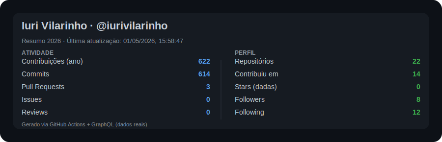

<h1 align="center">Olá! 👋</h1>

Sou um desenvolvedor <strong>Back-end</strong> com interesse em <strong>Java, Spring Boot, Node.js e Python</strong>.
Sempre busco aprimorar meus conhecimentos nessas tecnologias.

Atualmente trabalho como desenvolvedor <strong>Back-end Java (Spring Boot)</strong>, com foco em <strong>APIs REST</strong>.

 

## 📊 Meus status

 

<h2 align="center">🛠 Linguagens e ferramentas</h2>

  
  
  
  
  
  
  
  
  
  

 

<h2 align="center">📫 Contato</h2>

  
  

 

